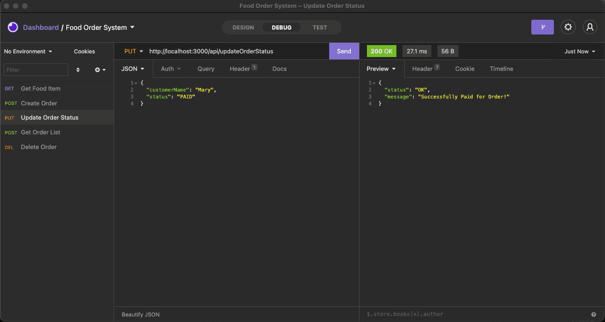

# simple-food-order-system-express-sequelize-mysql-api

To run the project locally

1. git clone the project repo

2. npm install

3. nodemon server.js

 

<Strong>
Project Description
</Strong>

- Create a simple food order system that allows user to add customer’s order and update order status
- Use database migration to create the table schemas
- Use database seeding to create food items
- Consist of 5 APIs (output of the screenshot will be provided beloew):
 
    a. Get Food Item <Strong>(/api/getProductList)</Strong>
     

     b. Create Order <Strong>(/api/createOrder)</Strong> 
         

     c. Update Order Status <Strong>(/api/updateOrderStatus)</Strong> 
     

     d. Get Order List <Strong>(/api/getOrderList)</Strong> 
     

     e.Delete Order <Strong>(/api/deleteOrde)</Strong> 
     

    

 

## Screenshots

 

<Strong><u>Get Food Item</u></Strong>

   

<Strong><u>Create Order</u></Strong>

   

<Strong><u>Update Order Status</u></Strong>

   

<Strong><u>Get Order List</u></Strong>

   

<Strong><u>Delete Order</u></Strong>

   

